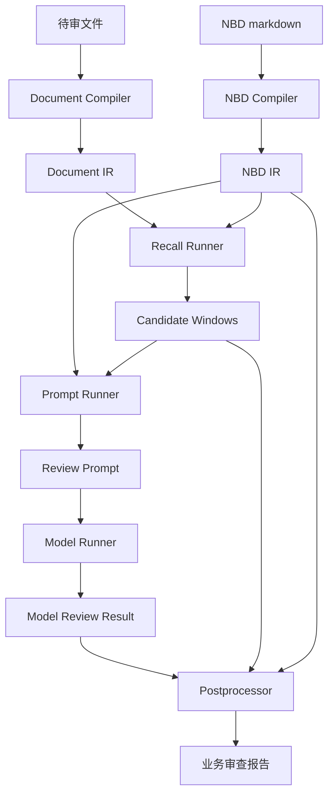

上级导航：[[index|新版 BD 审查点明细库]]

# NBD 可运行知识与 CLI 运行时协议设计

## 1. 核心类比

本体系按“编译后知识 + 通用运行时”的方式设计：

```text
NBD markdown     = 源码
NBD IR           = 编译后的可运行知识
CLI runtime      = JVM
待审文件          = 输入数据
Document IR      = 编译后的文档结构
CandidateWindow  = 中间证据层
Prompt           = 执行指令包
小模型            = SOP 执行器
业务报告          = 运行结果
```

目标是：

```text
一次编译，到处运行。
```

这里的“到处运行”不是指完全脱离 CLI，而是指任何实现同一套 NBD IR、Document IR、CandidateWindow 和 Prompt 协议的运行时，都可以加载同一个 NBD 执行审查。

## 2. 根本边界

### 2.1 NBD 的职责

NBD 是唯一业务知识单元，必须包含：

```text
审查点定义
适用范围
法规依据
召回逻辑
上下文读取规则
命中条件
排除条件
待复核边界
风险提示
修改建议
小模型执行 SOP
```

NBD 不只是给人看的说明书，也必须包含 CLI 可解释的机器召回配置。

### 2.2 CLI 的职责

CLI 是通用运行时，只负责：

```text
读取 NBD
编译 NBD IR
读取待审文件
编译 Document IR
根据 NBD IR 在 Document IR 中召回候选窗口
把 NBD IR 与候选窗口渲染成 prompt
调用小模型
归一化模型结果
聚合业务报告
输出可复盘运行目录
```

CLI 不得包含：

```text
NBDxx-xxx 专属召回词
NBDxx-xxx 专属命中逻辑
NBDxx-xxx 专属排除逻辑
NBDxx-xxx 专属风险解释
```

### 2.3 小模型的职责

小模型只做 SOP 判断：

```text
读取 NBD Prompt IR / 可执行 SOP
读取候选窗口
判断命中 / 待人工复核 / 不命中
给出证据、原因、风险提示、修改建议
输出标准 JSON
```

小模型不负责全文找证据。证据查找由 CLI 根据 NBD IR 完成。

## 3. 标准运行链路



## 4. CLI 命令形态

保留一个 CLI 产品，拆成多个 stage。不要拆成多个互相漂移的脚本。

### 4.1 日常业务命令

业务系统只需要一个命令：

```bash
python3 scripts/nbd_review/main.py run \
  --review-file xxx.docx \
  --base-url ... \
  --api-key ... \
  --model ... \
  --jobs 10
```

### 4.2 调试命令

调试和治理时允许拆阶段：

```bash
python3 scripts/nbd_review/main.py compile-document --review-file xxx.docx
python3 scripts/nbd_review/main.py compile-nbd --nbd NBD01-017
python3 scripts/nbd_review/main.py recall --review-file xxx.docx --nbd NBD01-017
python3 scripts/nbd_review/main.py build-prompt --run-dir validation/nbd-runs/...
python3 scripts/nbd_review/main.py run-model --run-dir validation/nbd-runs/...
python3 scripts/nbd_review/main.py report --run-dir validation/nbd-runs/...
```

### 4.3 命令边界

```text
compile-document：只处理待审文件，不读取 NBD。
compile-nbd：只处理 NBD，不读取待审文件。
recall：Document IR + NBD IR -> CandidateWindow。
build-prompt：NBD IR + CandidateWindow -> prompt。
run-model：prompt -> 小模型 JSON。
report：模型 JSON -> 业务报告。
run：串联以上阶段。
```

## 5. 标准运行目录

每次运行必须生成可复盘目录：

```text
validation/nbd-runs/{timestamp}-nbd-review/
  run.json
  document-ir.json
  facts.json
  nbd-ir/
    NBD01-017.json
  recall-ir/
    NBD01-017.json
  prompt-ir/
    NBD01-017.json
  governance-ir/
    NBD01-017.json
  candidates/
    NBD01-017.json
  prompts/
    NBD01-017.md
    NBD01-017.json
    prompt-stats.json
  raw-responses/
    NBD01-017.json
  items/
    NBD01-017/
      result.json
      summary.md
  recall_matrix.json
  recall_matrix.md
  nbd-results.json
  业务审查报告.md
```

这不是临时输出，而是运行证据链。

## 6. Document IR

Document IR 是待审文件的标准结构化表示。

### 6.1 Document IR 顶层

```json
{
  "schema_version": "document-ir/v1",
  "source_file": "...",
  "extractor": "python-docx-blocks",
  "stats": {
    "block_count": 0,
    "line_count": 0,
    "table_blocks": 0,
    "paragraph_blocks": 0
  },
  "blocks": [],
  "facts": {}
}
```

### 6.2 DocumentBlock

```json
{
  "block_id": "b0342",
  "block_type": "table",
  "order_index": 342,
  "line_start": 342,
  "line_end": 347,
  "text": "...",
  "lines": [],
  "section_path": ["第一册", "用户需求书", "实质性条款"],
  "section_role": "user_requirement",
  "section_role_confidence": 0.82,
  "section_role_reason": [
    "命中标题/结构词：用户需求书",
    "继承上级角色：user_requirement"
  ],
  "structural_features": [
    "table",
    "contains_requirement",
    "contains_score"
  ]
}
```

### 6.3 section_role 原则

`section_role` 是弱标签，不是风险结论。

```text
可以加权。
可以降噪。
不得硬删除候选。
低置信度时必须回退关键词召回。
```

## 7. NBD IR

NBD IR 是从 NBD markdown 编译出的可运行知识。

自 2026-04-30 起，NBD IR 保留兼容入口，同时拆出三类运行子 IR：

| IR | 消费方 | 内容边界 | 是否进入 prompt |
|---|---|---|---|
| Recall IR | Recall Runner | 召回词、正式证据词、噪声词、冲突词、完整性要素、候选召回规则、上下文读取规则 | 不直接进入 |
| Prompt IR | Prompt Runner / 小模型 | 审查目标、适用范围、专项判断方法、基础命中条件、命中条件、排除条件、待复核边界、结果分流、输出模板、审查依据 | 进入 |
| Governance IR | 人和 audit | 来源、版本、验证记录、变更记录、审计链接 | 不进入 |

NBD markdown 是唯一源码；三类 IR 是编译产物。runtime 不得绕过 IR 直接把整页 markdown 塞进 prompt。

### 7.1 NBD IR 顶层

```json
{
  "schema_version": "nbd-ir/v1",
  "id": "NBD06-006",
  "title": "...",
  "status": "maintained",
  "source_path": "wiki/bd-review-points/items/...",
  "scope": {},
  "recall": {},
  "sop": {},
  "output": {}
}
```

### 7.2 recall

```json
{
  "primary_terms": [],
  "formal_evidence_terms": [],
  "noise_terms": [],
  "section_role_terms": [],
  "support_context_terms": [],
  "high_value_combinations": [],
  "medium_value_combinations": [],
  "low_value_combinations": [],
  "window_expansion": {
    "reason": "分包内容金额比例召回",
    "neighbor_after": 2,
    "heading_expand": true
  },
  "priority_policy": {
    "formal_evidence_boost": true,
    "noise_demote": true,
    "template_demote": true
  }
}
```

来源对应 NBD markdown：

```text
定位与召回剖面 -> 基础召回词簇
机器召回配置 -> 可执行召回参数
候选召回规则 -> 排序与主辅窗口策略
上下文读取规则 -> 窗口扩展策略
```

### 7.3 sop

```json
{
  "goal": "...",
  "applicability": "...",
  "review_steps": [],
  "hit_conditions": [],
  "exclusion_conditions": [],
  "manual_review_boundaries": [],
  "verdict_policy": {
    "hit": "...",
    "manual_review": "...",
    "not_hit": "..."
  }
}
```

### 7.4 output

```json
{
  "risk_level": "高|提醒|待复核",
  "finding_type": "...",
  "risk_tip": "...",
  "revision_suggestion": "...",
  "legal_basis": []
}
```

## 8. NBD markdown 标准段落

一个 maintained NBD 应至少包含：

```text
审查目标
适用范围
定位与召回剖面
机器召回配置
候选召回规则
上下文读取规则
专项判断方法
基础命中条件
命中条件
排除条件
判断结果分流
风险提示
修改建议
审查依据
边界例
易误报场景
地区适用说明
```

`示例`、`反例` 仅在有真实有效内容时保留；不得使用“待补充”“待 smoke”“待预检”“待验证”等占位。

`调试备注`、`小模型可执行性自检` 属于治理记录，应写入 `wiki/bd-review-points/audits/` 或 `validation/nbd-runs/`，不得保留在 maintained NBD 页面主体中。

`机器召回配置` 标准格式：

```md
## 机器召回配置
### 主召回词
- 分包
- 分包意向协议

### 正式证据词
- 本项目允许
- 合同金额

### 降权噪声词
- 中小企业声明函
- 格式附件

### 窗口扩展
- 召回原因：分包内容金额比例召回
- 标题后继块数：2
```

## 9. CandidateWindow

CandidateWindow 是 NBD 与小模型之间最关键的中间证据层。

```json
{
  "schema_version": "candidate-window/v1",
  "nbd_id": "NBD06-006",
  "window_id": "W01",
  "window_type": "primary",
  "section_role": "user_requirement",
  "section_role_confidence": 0.82,
  "section_path": [],
  "line_anchor": "0342-0347",
  "score": 42.1,
  "recall_reason": [
    "分包内容金额比例召回=分包、分包承担主体"
  ],
  "recall_quality": "good",
  "completeness": {
    "条款标题": true,
    "条款正文": true
  },
  "text": "...",
  "block_ids": ["b0342"],
  "hit_words": {},
  "source": {
    "document_ir": "document-ir.json",
    "nbd_ir": "nbd-ir/NBD06-006.json",
    "nbd_recall_config": true
  }
}
```

### 9.1 window_type

```text
primary：可作为风险判断主证据。
support：只补事实、模板、反证、上下文。
```

### 9.2 recall_quality

```text
good：主证据完整，可以进入判断。
partial：候选相关，但缺上下文。
noisy：主要是模板、通用条款或格式文本。
miss：未找到有效候选。
```

## 10. Prompt Runner

Prompt 不应手写拼凑，而是标准渲染：

```text
Prompt = system_instruction + output_schema + Prompt IR/SOP + fact_summary + CandidateWindows
```

### 10.1 Prompt 固定结构

```text
1. 系统角色
2. 输出 JSON schema
3. 目标 NBD
4. NBD 可执行 SOP
5. 轻事实摘要
6. 候选窗口 primary/support
7. 判断要求
```

### 10.2 Prompt 约束

必须明确告诉小模型：

```text
只能基于 NBD 与候选窗口判断。
轻事实摘要只作背景，不得单独构成命中证据。
不得把目录、模板、通用条款直接当正式风险证据。
候选不足时输出待人工复核或不命中。
输出必须是严格 JSON。
```

### 10.3 Prompt 瘦身协议

日常 prompt 只允许包含小模型三分流判断所需内容：

```text
审查目标
适用范围 / 不适用范围
专项判断方法
基础命中条件
命中条件
排除条件
待人工复核边界
判断结果分流
风险提示
修改建议
审查依据
```

以下内容不得进入日常 prompt：

```text
定位与召回剖面全文
机器召回配置
候选召回调试记录
调试备注
小模型可执行性自检
待 smoke / 待预检 / 待验证
空示例 / 空反例占位
```

每个 prompt artifact 必须输出字符统计，至少包括：

```json
{
  "prompt_stats": {
    "prompt_source": "prompt-ir",
    "system_chars": 0,
    "user_chars": 0,
    "total_chars": 0,
    "nbd_sop_chars": 0,
    "truncated": false
  }
}
```

## 11. ModelReviewResult

小模型输出统一归一化为：

```json
{
  "schema_version": "model-review-result/v1",
  "nbd_id": "NBD06-006",
  "nbd_title": "...",
  "verdict": "命中|待人工复核|不命中",
  "summary": "...",
  "candidate_count": 0,
  "execution_trace": {
    "candidate_recall": {},
    "context_reading": {},
    "clause_classification": {},
    "hit_conditions": {},
    "exclusion_checks": {},
    "result_branch": {}
  },
  "candidates": [
    {
      "line_anchor": "0342-0347",
      "excerpt": "...",
      "clause_type": "履约要求",
      "candidate_verdict": "命中",
      "reason": "..."
    }
  ],
  "risk_tip": "...",
  "revision_suggestion": "...",
  "legal_basis": []
}
```

## 12. Postprocessor

Postprocessor 不重新审查，只做归一化和聚合：

```text
校验 JSON
补默认字段
按业务问题聚类
合并同源 NBD
生成业务报告
生成调试矩阵
```

禁止：

```text
在 postprocessor 中新增风险判断规则。
用报告生成逻辑覆盖小模型 verdict。
把模板噪声重新包装成业务风险。
```

## 13. 工程模块建议

当前可以保留 `main.py + engine.py`，但内部应按 stage 拆函数。达到稳定后再拆模块。

建议最终结构：

```text
scripts/nbd_review/
  main.py
  engine.py
  document_compiler.py
  nbd_compiler.py
  recall_runner.py
  prompt_runner.py
  model_runner.py
  postprocessor.py
  reporters.py
  schemas.py
```

拆分触发条件：

```text
单文件超过 1200 行。
某一 stage 需要单独测试。
出现多个 CLI command 复用同一 stage。
schema 需要版本化。
```

## 14. 风险防线设计

本节用于防住运行时协议落地时最容易发生的 5 类架构退化。

### 14.1 风险一：NBD IR 太弱

风险表现：

```text
只是把 markdown 段落原样塞进 JSON。
recall、sop、output 没有结构化。
CLI 仍然需要回头解析自由文本才能运行。
```

防线：

```text
NBD IR 必须结构化输出 recall / sop / output 三大块。
recall 必须包含 primary_terms、formal_evidence_terms、noise_terms、window_expansion。
sop 必须包含 hit_conditions、exclusion_conditions、manual_review_boundaries。
output 必须包含 risk_tip、revision_suggestion、legal_basis。
```

验收检查：

```text
compile-nbd 生成 nbd-ir/{id}.json。
若 maintained NBD 缺少机器召回配置，compile-nbd 输出 warning。
若 recall/sop/output 任一为空，compile-nbd 输出 invalid。
```

最低标准：

```text
NBD IR 不是 markdown 转 JSON。
NBD IR 必须能直接驱动 recall、prompt 和 report。
```

### 14.2 风险二：CLI 又长回规则库

风险表现：

```text
engine.py 出现 NBD01-017、NBD06-006 等具体 ID。
代码里维护 NBD 专属召回词。
代码里对某个 NBD 做 if/else 特判。
```

防线：

```text
CLI 只能读取 NBD IR。
CLI 只能实现通用算法。
所有具体风险词、反证词、噪声词、窗口扩展参数都必须来自 NBD。
```

验收检查：

```bash
rg "NBD[0-9]{2}-[0-9]{3}" scripts/nbd_review
rg "RECALL_PROFILES|checkpoint_profiles|if .*NBD" scripts/nbd_review
```

最低标准：

```text
除测试样例、日志字段、文件名渲染外，runtime 代码中不得出现具体 NBD ID 业务配置。
```

### 14.3 风险三：Prompt 模板偷塞判断逻辑

风险表现：

```text
prompt_builder 中写入 NBD 没有的命中条件。
prompt 模板按 NBD ID 补业务规则。
prompt 层改变 NBD 的判断边界。
```

防线：

```text
Prompt Runner 只做标准渲染。
Prompt 中的业务判断文本只能来自 NBD IR.sop。
系统提示只规定角色、证据限制、输出格式和禁止事项。
```

验收检查：

```text
抽查 prompts/{id}.md，业务条件必须能回溯到 nbd-ir/{id}.json。
prompt_runner 不得读取 NBD ID 做分支。
prompt_runner 不得出现具体风险词硬编码。
```

最低标准：

```text
Prompt 是包装层，不是第二套规则库。
```

### 14.4 风险四：CandidateWindow 不可复盘

风险表现：

```text
只知道模型看了什么文本，不知道为什么召回。
不知道候选来自哪个 NBD 配置。
不知道为什么是 primary 或 support。
不知道模板噪声为什么被排在前面。
```

防线：

```text
CandidateWindow 必须带 source。
CandidateWindow 必须带 recall_reason、hit_words、score、completeness。
CandidateWindow 必须带 document_ir block_id 和 nbd_ir source。
recall_matrix 必须展示 profile added、top role、duplicate skipped、recall_quality。
```

验收检查：

```text
candidates/{id}.json 能回溯到 document-ir.json 的 block_id。
candidates/{id}.json 能回溯到 nbd-ir/{id}.json 的 recall 配置。
每个 primary window 至少有一条 recall_reason。
```

最低标准：

```text
任何业务问题都能回答“为什么这个窗口进来了”。
```

### 14.5 风险五：153 个 NBD 召回配置质量不均

风险表现：

```text
部分 NBD 有机器召回配置，部分没有。
配置格式不统一。
配置缺失型 NBD 没有反证词。
风险型 NBD 没有高价值风险对象词。
```

防线：

```text
按 NBD 类型模板批量补齐机器召回配置。
compile-nbd 增加 lint。
preflight 全量检查 recall_quality。
问题 NBD 进入召回配置修复清单。
```

验收检查：

```text
153 个 maintained NBD 均包含 ## 机器召回配置。
配置缺失型 NBD 均包含反证词或正式证据词。
风险型 NBD 均包含主风险对象词和降权噪声词。
全量 preflight 无 miss；高风险 NBD recall_quality 不低于 partial。
```

最低标准：

```text
所有 maintained NBD 都必须是可运行知识，而不是半成品说明书。
```

## 15. 强制红线

以下情况应视为架构违规：

```text
在 runtime 代码中新增 NBD 专属硬编码。
在 prompt 模板中新增 NBD 专属判断。
在 postprocessor 中新增风险命中逻辑。
候选窗口无法回溯到 NBD IR 和 Document IR。
maintained NBD 缺少机器召回配置。
模型结果覆盖候选窗口证据边界。
```

处理原则：

```text
发现红线问题，优先修协议或 NBD，不通过临时硬编码绕过。
```

## 16. 完整实施路线

### Phase 1：协议固化

- 固化本设计文档。
- 明确 NBD markdown 必含 `机器召回配置`。
- 明确运行目录与 4 个核心 schema。
- 清除 CLI 中所有 NBD 专属硬编码。

### Phase 2：编译产物落盘

- 输出 `document-ir.json`。
- 输出 `nbd-ir/{id}.json`。
- 输出 `candidates/{id}.json`。
- prompt 只从 IR 和 CandidateWindow 渲染。

### Phase 3：153 个 NBD 补齐机器召回配置

- 所有 maintained NBD 补齐 `机器召回配置`。
- 每个 NBD 的召回词、正式证据词、噪声词、窗口扩展都来自 NBD 本体。
- 运行 preflight，检查 `profile added` 和 `recall_quality`。

### Phase 4：多阶段 CLI

- 增加 `compile-document`。
- 增加 `compile-nbd`。
- 增加 `recall`。
- 增加 `build-prompt`。
- 增加 `run-model`。
- 增加 `report`。
- 保留 `run` 作为业务主入口。

### Phase 5：回归验证

- 用 10 个深圳品目批注文件跑 preflight。
- 用至少 3 份真实文件跑 153 全量。
- 对比基线：命中、待复核、不命中、业务问题聚合数。
- 重点验收：候选窗口是否准、全、少重复。

## 17. 验收标准

### 17.1 架构验收

- `engine.py` 不出现具体 NBD ID 的业务配置。
- CLI 可以从 NBD markdown 编译出 NBD IR。
- 候选窗口可以追溯到 NBD 的机器召回配置。
- prompt 可以追溯到 NBD IR 和 CandidateWindow。

### 17.2 NBD 验收

- 153 个 maintained NBD 均包含 `机器召回配置`。
- 每个 NBD 的主召回词不少于 3 个。
- 每个 NBD 至少有正式证据词或降权噪声词之一。
- 配置缺失型 NBD 必须有反证召回词。
- 风险型 NBD 必须有高价值风险对象词。

### 17.3 召回验收

- 关键风险的正式证据进入 primary window。
- 模板、声明函、通用条款不挤占 primary window。
- 标题型证据能合并后继正文。
- `recall_matrix.md` 能解释为什么召回、为什么降权、为什么缺失。

### 17.4 模型验收

- 小模型 prompt 中包含 NBD SOP 和候选窗口。
- 小模型不需要全文查找证据。
- 小模型输出 JSON 可被稳定解析。
- 候选不足时不强行命中。

## 18. 任务清单

### 18.1 P0：协议与红线

- [x] 固化 `Document IR`、`NBD IR`、`CandidateWindow`、`ModelReviewResult` 四个 schema。
- [x] 在运行时中加入 schema_version。
- [x] 为 `scripts/nbd_review` 增加硬编码扫描检查，禁止 NBD 专属 ID 配置。
- [x] 为 prompt runner 增加约束：业务判断只能来自 NBD IR。
- [x] 为 postprocessor 增加约束：只聚合，不重新审查。

P0 执行记录：

```text
完成时间：2026-04-29
运行时代码：scripts/nbd_review/main.py、scripts/nbd_review/engine.py
新增命令：lint-runtime
新增 schema_version：document-ir/v1、nbd-ir/v1、candidate-window/v1、model-review-result/v1、nbd-runtime/v1
新增落盘：document-ir.json、nbd-ir/{id}.json
新增护栏：runtime 硬编码扫描、prompt 边界约束、postprocessor 边界注释
```

P0 严格整改补充：

```text
报告层不得通过 NBD ID、标题关键词或证据关键词推断业务问题类型。
Postprocessor 只能使用模型结构化输出、NBD 元数据、证据位置、候选窗口来源进行聚合和展示。
已移除按“服务网点/分包/高空/证书”等关键词归类的报告层逻辑。
```

### 18.2 P1：编译产物落盘

- [x] `run` 输出 `document-ir.json`。
- [x] `run` 输出 `nbd-ir/{id}.json`。
- [x] `run` 输出 `candidates/{id}.json`。
- [x] `items/{id}/result.json` 引用 document_ir、nbd_ir、candidate_file、prompt_file、raw_response_file。
- [x] `recall_matrix.json` 增加正式证据占比、模板噪声占比、缺失原因字段。

P1 执行记录：

```text
完成时间：2026-04-29
运行时代码：scripts/nbd_review/engine.py
新增 schema：candidate-set/v1
新增落盘：candidates/{id}.json
新增 result 引用：document_ir、nbd_ir、candidate_file、prompt_file、raw_response_file
新增 recall_matrix 字段：formal_evidence_ratio、template_noise_ratio、missing_reason
验证命令：lint-runtime、preflight 小样本、run 小样本
验证目录：validation/nbd-runs/20260429-161417-nbd-preflight、validation/nbd-runs/20260429-161438-nbd-review
```

P1 严格整改补充：

```text
运行目录内部产物引用必须使用 run-dir 相对路径，例如 document-ir.json、nbd-ir/{id}.json、candidates/{id}.json。
不得在 result.json 中写入绑定本机 workspace 的产物路径，保证运行目录可搬运、可复盘。
--resume 命中旧 result.json 时，必须校验 document_ir、nbd_ir、candidate_file、prompt_file、raw_response_file 五类引用及目标文件均存在。
若旧 result.json 缺少 P1 产物引用或引用目标不存在，不得直接复用，必须重新补齐候选集、prompt、模型响应引用和 result.json。
验证目录：validation/nbd-runs/p1-clean-check
验证结论：二次 run/resume 后，result.json 五类引用均为 run-dir 相对路径，所有引用目标存在，candidates/{id}.json 为 candidate-set/v1。
```

### 18.3 P2：多阶段 CLI

- [x] 增加 `compile-document` command。
- [x] 增加 `compile-nbd` command。
- [x] 增加 `recall` command。
- [x] 增加 `build-prompt` command。
- [x] 增加 `run-model` command。
- [x] 增加 `report` command。
- [x] 保留 `run` 作为业务主入口，并串联所有 stage。

P2 执行记录：

```text
完成时间：2026-04-29
运行时代码：scripts/nbd_review/main.py、scripts/nbd_review/engine.py
新增命令：compile-document、compile-nbd、recall、build-prompt、run-model、report
保留命令：run、preflight、lint-runtime
分阶段验证目录：validation/nbd-runs/p2-stage-check
一体化验证目录：validation/nbd-runs/p2-run-check
验证结论：分阶段链路和 run 主入口均可生成 document-ir、nbd-ir、candidate-set、prompt、raw-response、result、recall_matrix、业务审查报告。
```

P2 阶段边界：

```text
compile-document：只读取待审文件，输出 document-ir.json、facts.json、facts.md、run.json。
compile-nbd：只读取 NBD markdown，输出 nbd-ir/{id}.json。
recall：只读取 document-ir.json 与 nbd-ir/{id}.json，使用 NBD IR 中的 recall 配置生成 candidates/{id}.json 与 recall_matrix。
build-prompt：只读取 facts、NBD IR、CandidateSet，输出 prompts/{id}.md 与 prompts/{id}.json。
run-model：只读取 prompt 与候选集，调用小模型，输出 raw-responses/{id}.json 与 items/{id}/result.json。
report：只读取 items/{id}/result.json，输出 nbd-results.json、recall_matrix、业务审查报告。
run：业务主入口，串联以上 stage，不引入第二套业务规则。
```

P2 严格整改补充：

```text
stage command 之间通过落盘产物交接，不通过内存隐式状态交接。
prompt 的可执行消息必须落盘为 prompts/{id}.json；prompts/{id}.md 只作为人工查看版本。
run-model 不负责业务聚合报告；报告由 report stage 统一生成。
report 不重新审查，不调用模型，不改写小模型 verdict。
runtime lint 仍不得出现具体 NBD ID、NBD 专属召回 profile 或报告层业务关键词归类。
```

P2 严格整改补充二：

```text
compile-nbd 生成的 nbd-ir/{id}.json 必须包含下游运行所需的编译后知识，包括 frontmatter、recall、sop、output、prompt_text。
recall、build-prompt、run-model 从 nbd-ir/{id}.json 水合运行对象时，不得通过 source_path 回读 NBD markdown。
source_path 只作为 provenance，不作为 stage 之间继续读取源知识的入口。
run-model 必须只读取 prompts/{id}.json 作为模型消息输入；若 prompts/{id}.json 缺失，应失败并提示先执行 build-prompt，不得暗中重建 prompt。
验证目录：validation/nbd-runs/p2-clean-stage-check、validation/nbd-runs/p2-clean-run-check
负向验证：validation/nbd-runs/p2-clean-missing-prompt 缺少 prompts/NBD01-017.json 时，run-model 按预期失败。
验证结论：NBD IR 可独立水合运行对象，不依赖源 markdown；分阶段链路和 run 主入口均正常。
```

### 18.4 P3：153 个 NBD 机器召回配置

- [x] 定义 NBD 类型到机器召回配置的模板。
- [x] 批量补齐 153 个 NBD 的 `## 机器召回配置`。
- [x] 配置缺失型 NBD 补反证词。
- [x] 风险型 NBD 补高价值风险对象词。
- [x] 履约配置型 NBD 补金额、比例、期限、责任、退还等要素词。
- [x] 品目专项 NBD 补品目事实词和不适用降权词。
- [x] 运行全量 NBD lint。

P3 类型模板：

```text
明确禁止型 / 评分因素型 / 合理性判断型：
主召回词 = 对象词簇 + 章节角色词。
正式证据词 = 对象词簇 + 行为词簇 + 后果词簇 + 支持上下文词，重点覆盖“风险对象 + 约束动作 + 资格/评分/响应后果”。
降权噪声词 = 降权/排除词 + 目录、格式模板、声明函、承诺函、合同通用条款、示范文本。

配置缺失型：
主召回词 = 配置对象词 + 正式配置章节词。
正式证据词 = 配置对象词 + 载明、明确、列明、注明、设置等反证词 + 支持上下文词。
降权噪声词 = 模板、目录、格式、合同通用条款、空白待填。

政策判断型：
主召回词 = 政策对象词 + 预算、品目、政策设置词。
正式证据词 = 预算金额、最高限价、采购品目、专门面向、不专门面向、预留份额、价格扣除等。
降权噪声词 = 声明函格式、价格扣除格式、进口产品、联合体协议、非适用项目说明。

履约配置型 / 数值比例型：
主召回词 = 履约对象词 + 合同/商务章节词。
正式证据词 = 金额、比例、期限、退还、付款方式、履约保证金、质量保证期、合同履行期限等。
降权噪声词 = 合同通用条款、示范文本、空白待填、格式模板。

品目专项型：
主召回词 = 品目事实词 + 资质/证书/检测报告/产品/服务对象词。
正式证据词 = 采购需求、货物清单、服务内容、技术要求、品目、资质、证书、检测报告、产品等。
降权噪声词 = 不适用品目、格式模板、证书样式、声明函、通用说明。
```

P3 执行记录：

```text
完成时间：2026-04-29
治理对象：wiki/bd-review-points/items/NBD*.md
NBD 总数：153
maintained 数量：153
治理前已有机器召回配置：14
本次补齐机器召回配置：139
治理后具备机器召回配置：153
主召回词不少于 3 个：153
具备正式证据词：153
具备降权噪声词：153
具备窗口扩展配置：153
全量编译目录：validation/nbd-runs/p3-nbd-lint
NBD IR 数量：153
NBD IR lint errors：0
NBD IR lint warnings：0
machine_recall enabled：153
```

P3 严格整改补充：

```text
机器召回配置不是第二套业务判断规则，只是候选窗口定位参数。
命中条件、排除条件、判断分流仍以 NBD SOP 为准。
本次自动补齐只使用每个 NBD 本体中的定位与召回剖面、标题、frontmatter 类型信息，不从 runtime 写入 NBD 专属规则。
已有手工标杆机器召回配置保持原样，不被批量模板覆盖。
风险型 NBD 的正式证据词必须均衡包含对象词、行为词、后果词和支持上下文词，避免只召回孤立对象。
配置缺失型 NBD 的正式证据词按反证召回设计，用于找到“已载明/已明确”的正式配置窗口。
```

### 18.5 P4：召回回归

- [x] 对 10 个深圳品目批注文件跑 153 全量 preflight。
- [x] 输出每份文件的 `recall_matrix.md`。
- [x] 统计每个 NBD 的 miss、partial、noisy、good 分布。
- [x] 对 miss/noisy NBD 建立修复清单。
- [x] 抽查配置缺失型 NBD 是否成功召回反证。
- [x] 抽查风险型 NBD 是否成功召回正式主证据。

P4 执行记录：

```text
完成时间：2026-04-29
回归目录：validation/nbd-runs/20260429-171928-p4-recall-regression
文件清单：manifest.md、manifest.json
批量日志：batch.log、batch-rerun.log
总报告：P4召回回归报告.md
专项抽查：P4专项抽查统计.md
明细表：p4-details.tsv
汇总数据：p4-summary.json、p4-special-audit.json
回归文件数：10
覆盖品目：信息化设备、信息技术服务、其他服务、医疗设备、家具、教学仪器、物业管理、用具、社会治理服务、装具
NBD 数量：153
召回记录：1530
```

P4 召回质量结果：

```text
good：1218
partial：312
noisy：0
miss：0
miss/noisy 修复清单：0
高频 partial 观察项：43
```

P4 专项抽查结果：

```text
配置缺失型记录：200
配置缺失型 primary 覆盖：200
配置缺失型平均正式证据占比：0.9565
配置缺失型结论：反证召回成功；14 条 partial 为 completeness 口径偏保守，不是反证缺失。

风险型记录：580
风险型 primary 覆盖：580
风险型平均正式证据占比：0.998
风险型正式主证据弱项：0

政策判断型记录：70
政策判断型 good：66
政策判断型 partial：4

品目专项型记录：290
品目专项型 good：289
品目专项型 partial：1
```

P4 调优记录：

```text
初次专项抽查发现 3 个风险型 NBD 的 formal_evidence_ratio 为 0：
NBD02-032 不得将应急预案作为评审因素，但未在采购需求中体现相关内容
NBD07-018 涉及高空服务的项目，必须设置特种作业操作证（作业类别：高处作业）
NBD07-028 不得设置与需求不相符的资质要求

整改方式：
仅补强上述 NBD 的正式证据词，使其覆盖真实文档中常见的候选表达。
未修改命中条件、排除条件或判断分流。
未在 runtime 中增加任何 NBD 专属规则。

复跑结果：
风险型正式主证据弱项由 26 条降为 0。
总体 good 由 1211 提升到 1218。
总体 partial 由 319 降到 312。
全量重新编译 NBD IR：153，errors：0，warnings：0。
```

### 18.6 P5：小模型回归

- [x] 选择至少 3 份真实文件跑 153 全量小模型审查。
- [x] 对比调优前后的命中、待复核、不命中分布。
- [x] 对比业务问题聚合数。
- [x] 抽查所有命中项的证据窗口是否为 primary。
- [x] 抽查所有待复核项是否写清业务人员需要确认什么。
- [x] 生成回归报告。

P5 回归记录：

```text
运行目录：
validation/nbd-runs/20260429-173300-p5-model-regression

真实文件：
1. 物业管理：[SZCG2025000887-A]深圳市南山区人民法院物业管理服务项目.docx
2. 医疗设备：[LGCG2024000217-A]龙岗区耳鼻咽喉医院口腔综合治疗台等设备采购项目.docx
3. 家具：东北师范大学附属中学深圳学校家具采购.docx

审查规模：
文件数：3
NBD：153
模型结果：459
模型：qwen3.5-27b
jobs：10
失败数：0

调优前：
命中：34
待人工复核：74
不命中：351
业务问题聚合数：32
复核事项聚合数：67
命中无证据摘录：1
非 primary 命中证据：1
缺失型空证据命中：1
待复核缺说明：0

本轮调优：
NBD04-002 按规定载明核心产品

调优方式：
只补强 NBD 标准检查点说明书和机器召回配置。
明确“核心产品品牌表”“未列明核心产品无需填写”等投标文件格式内容只能作为辅助线索。
明确缺失型命中也必须列出已核查的正式章节候选窗口。
明确通用法规转述不等于本项目已载明核心产品，也不能单独作为缺失命中证据。
未在 runtime 中加入任何 NBD 专属分支。

调优后：
命中：32
待人工复核：75
不命中：352
业务问题聚合数：30
复核事项聚合数：68
命中无证据摘录：0
非 primary 命中证据：0
缺失型空证据命中：0
待复核缺说明：0

结论：
日常 153 全量小模型审查链路可跑通。
NBD04-002 暴露的缺失型证据问题已通过 NBD 自身修复。
P5 未引入 runtime 硬编码，仍保持“CLI 是运行时、NBD 是可运行知识”的边界。
```

### 18.7 P6：工程拆分

- [x] 当 `engine.py` 继续膨胀时拆出 `document_compiler.py`。
- [x] 拆出 `nbd_compiler.py`。
- [x] 拆出 `recall_runner.py`。
- [x] 拆出 `prompt_runner.py`。
- [x] 拆出 `model_runner.py`。
- [x] 拆出 `postprocessor.py`。
- [x] 拆出 `reporters.py`。
- [x] 将 schema 定义集中到 `schemas.py`。

P6 工程拆分记录：

```text
保留入口：
scripts/nbd_review/main.py
scripts/nbd_review/engine.py

engine.py 定位：
兼容门面，只从 pipeline 导出 CLI 入口函数。
不得继续承载文档编译、NBD 编译、召回、prompt、模型调用或报告逻辑。

新增模块：
scripts/nbd_review/schemas.py：schema 常量、DocumentBlock、CandidateWindow、NBDItem。
scripts/nbd_review/utils.py：运行目录、文本读写、路径渲染、基础归一化、validate_checkpoint_cli 接入。
scripts/nbd_review/document_compiler.py：待审文件抽取、Document IR、轻事实摘要。
scripts/nbd_review/nbd_compiler.py：NBD markdown 编译为 NBD IR、机器召回配置解析、主题/ID 展开。
scripts/nbd_review/recall_runner.py：CandidateWindow 召回、评分、窗口扩展、召回矩阵。
scripts/nbd_review/prompt_runner.py：NBD IR + CandidateWindow + 轻事实摘要组合 prompt。
scripts/nbd_review/model_runner.py：小模型调用、模型结果规范化、单 NBD 执行。
scripts/nbd_review/postprocessor.py：只做模型结果证据选择和业务问题聚合，不重新审查。
scripts/nbd_review/reporters.py：召回矩阵和业务审查报告渲染。
scripts/nbd_review/pipeline.py：CLI 子命令编排。

验证：
python3 -m py_compile scripts/nbd_review/*.py
python3 scripts/nbd_review/main.py lint-runtime
python3 scripts/nbd_review/main.py preflight --review-file <真实文件> --nbd NBD04-002 --output-dir validation/nbd-runs/20260429-173300-p6-preflight-smoke
python3 scripts/nbd_review/main.py compile-document / compile-nbd / recall / build-prompt 分阶段 smoke
python3 scripts/nbd_review/main.py report --output-dir validation/nbd-runs/20260429-173300-p5-model-regression/02-医疗设备

结果：
py_compile：通过
runtime lint：通过
runtime 代码具体 NBD ID / 专属业务词扫描：无命中
真实文件 preflight：通过
分阶段 compile-document、compile-nbd、recall、build-prompt：通过
既有 153 结果报告重渲染：通过
```

P6 严格洁净补充：

```text
进一步整改：
1. postprocessor 对外 API 改为公共函数，reporters 不再跨模块 import 下划线私有函数。
2. looks_like_heading 从 document_compiler 下沉到 utils，避免 recall_runner 反向依赖 document_compiler。
3. 清理 pipeline、model_runner 中明显未使用 import。
4. 使用 -B 验证，避免生成 __pycache__ 缓存产物。
5. 单 NBD run 入口验证后，重新执行 report 恢复 P5 医疗设备目录 153 全量聚合结果。

严格检查：
syntax compile：通过
runtime lint：通过
import graph cycle：none
runtime 具体 NBD ID / 专属业务词扫描：无命中
report 重聚合结果数：153
```

## 19. 当前结论

下一步不应继续在 `engine.py` 中加入任何 NBD 专属召回逻辑。

正确路线是：

```text
补齐 NBD 机器召回配置
编译 NBD IR
编译 Document IR
用通用 Recall Runner 生成 CandidateWindow
用通用 Prompt Runner 组合 prompt
小模型按 SOP 输出结果
Postprocessor 只聚合报告
```

这样 NBD 才能真正成为“编译后可运行知识”，CLI 才能成为稳定的通用运行时。

## 20. 2026-04-30 长期治理基线

本协议在 P0-P4 后形成新的长期基线：

```text
NBD markdown 源码
  -> NBD IR：兼容入口与 metadata
  -> Recall IR：候选窗口定位
  -> Prompt IR：小模型可执行 SOP
  -> Governance IR：治理追溯
Document IR：待审文件结构
CandidateWindow：中间证据层
Prompt：通用 runtime 指令 + Prompt IR + 轻事实摘要 + CandidateWindow
业务报告：模型结果聚合，不重新审查
```

强制门槛：

1. `compile-nbd` 必须能输出 `nbd-ir/`、`recall-ir/`、`prompt-ir/`、`governance-ir/`。
2. maintained NBD 页面不得出现历史占位或治理段落。
3. `prompt_runner` 默认读取 Prompt IR 渲染后的可执行 SOP，不读取整页 markdown。
4. runtime lint 必须持续禁止具体 NBD ID、专属召回词表和业务规则库进入 Python。
5. 每次正式回归必须保留 `validation/nbd-runs/{timestamp}-.../` 运行证据链。

当前验收记录：

| 阶段 | 结论 | 目录 |
|---|---|---|
| P1 三类 IR 编译 | 153 个 NBD 全量通过 | `validation/nbd-runs/20260430-184838-P1-nbd-ir-split-compile` |
| P2 Prompt Runner 瘦身 | NBD SOP 平均字符下降约 55.2% | `validation/nbd-runs/20260430-185528-P2-0044A-full-build-prompt` |
| P3 页面清理 | 153 个 maintained 页面禁止内容复扫命中 0 | `validation/nbd-runs/20260430-190547-P3-nbd-page-cleanup` |
| P4 0044-A 回归 | 153 个模型结果，失败数 0 | `validation/nbd-runs/20260430-191042-P4-0044A-slim-full-qwen` |
