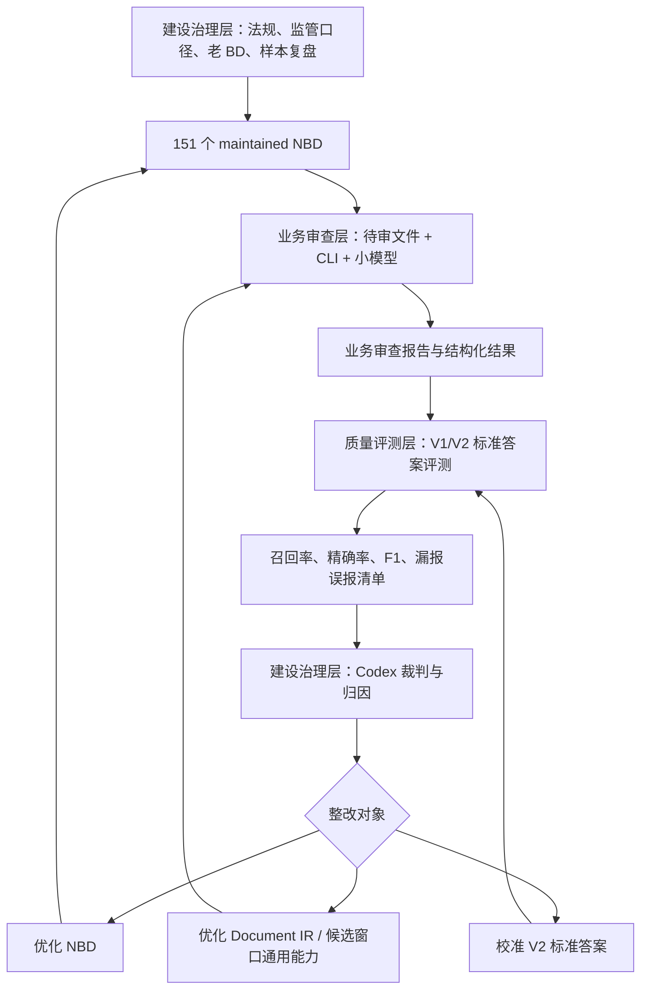
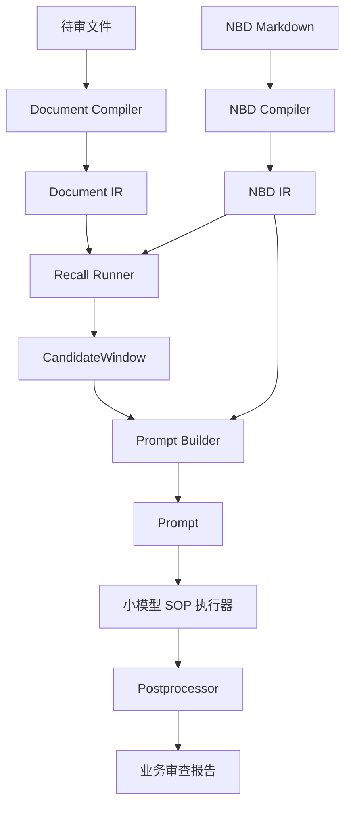
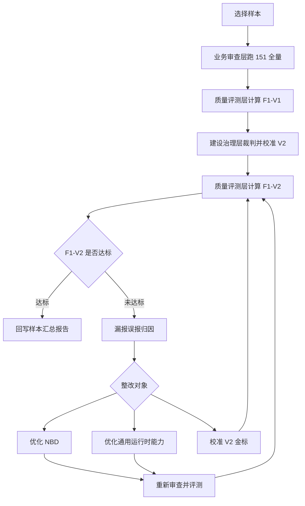

上级导航：[[index|新版 BD 审查点明细库]]

# NBD 可迭代质量工程体系方案

## 1. 方案定位

NBD 是面向政府采购文件合规审查的“可运行审查知识”。它不是单纯的审查点清单，也不是脚本规则库，而是把法规依据、监管口径、业务风险、候选窗口定位方法、SOP 判断步骤和小模型输出要求编译成可执行知识。

本方案用于说明 NBD 如何从知识建设、业务审查、质量评测到持续治理形成闭环，使 151 个 NBD 能稳定服务日常审查，并能通过样本评测持续提升召回率、精确率和 F1 值。

核心目标：

```text
日常审查可运行：待审文件 + 151 个 NBD + CLI + 小模型，稳定输出业务审查报告。
质量效果可量化：用标准答案 V1/V2 计算召回率、精确率和 F1 值。
问题归因可复盘：每次漏报、误报、金标调整都有明确原因和处理结论。
体系边界可治理：NBD 是可运行知识，CLI 是运行时，不让 CLI 变成第二套规则库。
```

## 2. 总体架构

NBD 质量工程体系分为三层：

```text
业务审查层：面向日常待审文件，负责产生业务审查报告。
质量评测层：面向样本评测，负责计算 F1-V1 / F1-V2 和输出漏报误报清单。
建设治理层：面向体系进化，负责裁判、归因、调优和方法论沉淀。
```

三层关系：



## 3. 业务审查层

业务审查层是日常生产主链，目标是让业务人员拿到可读、可复盘的审查报告。

输入：

```text
待审采购文件
151 个 maintained NBD
当前小模型配置，例如 qwen3.6-35b-a3b
```

输出：

```text
业务审查报告
结构化 NBD 审查结果
候选窗口、模型结果、召回矩阵等可复盘产物
```

运行流程：



业务审查层的职责边界：

| 内容 | 说明 |
|---|---|
| Document IR | 将待审文件编译成带行号、段落、表格、章节线索的文档结构 |
| NBD IR | 将 NBD Markdown 编译成可运行审查知识 |
| CandidateWindow | 按 NBD 召回协议从 Document IR 中定位候选证据 |
| Prompt | 将 NBD SOP 与候选窗口组合成小模型执行指令包 |
| 小模型 | 按 SOP 判断是否命中、是否待复核、是否不命中 |
| 业务报告 | 输出业务人员能看懂的问题、证据、位置和复核建议 |

业务审查层的原则：

```text
只执行 NBD，不读取标准答案。
只调用小模型，不引入 Codex 强模型复核。
只输出业务审查结果，不计算 F1。
CLI 只做通用运行时能力，不写 NBD 专属硬编码。
```

## 4. 质量评测层

质量评测层用于回答“工程审查结果到底好不好”，不直接参与日常业务审查。

输入：

```text
业务审查层运行结果
原始标准答案 V1
校准标准答案 V2
```

输出：

```text
F1-V1 指标
F1-V2 指标
漏报清单
误报清单
工程审查结果标准答案格式 JSON
样本汇总报告
```

指标公式：

```text
召回率 = 匹配成功数 / 标准答案数
精确率 = 匹配成功数 / 工程输出数
F1 值 = 2 * 召回率 * 精确率 / (召回率 + 精确率)
```

等价写法：

```text
F1 值 = 2 * 匹配成功数 / (标准答案数 + 工程输出数)
```

V1 与 V2：

| 口径 | 定义 | 用途 |
|---|---|---|
| V1 | 人工原始标准答案 | 保留原始业务批注口径，作为历史对照 |
| V2 | 按 151 个 NBD 原子审查点校准后的标准答案 | 作为当前 NBD 工程质量评测主口径 |

V2 形成规则：

1. 若 V1 中一个审查点实际包含多个 NBD 原子审查点，应拆成多个原子审查点。
2. 若工程额外输出经 Codex 裁判确认为真实风险，且属于 151 个 NBD 覆盖范围，应补入 V2。
3. 若工程额外输出真实存在但不属于 151 个 NBD 覆盖范围，应标记为“新增”，评测时忽略。
4. 若工程额外输出不构成风险，应作为误报处理，进入 NBD 或运行时边界收紧。
5. 若 V2 中某个复合审查点包含强口径和弱口径，弱口径经裁判不能稳定成立，应做裁判降级，只保留证据可支撑的原子审查点。

V2 不是为了追高 F1 任意扩充金标。它的作用是把原始标准答案校准到 151 个 NBD 的原子执行口径，让评测真正衡量工程审查能力。

V3 与 V4 形成规则：

| 口径 | 定义 | 用途 |
|---|---|---|
| V3 | 在 V2 基础上，仅回填“工程命中但 V2 未收”且经 Codex 复审确认成立的真风险 | 用于校准 V2 漏收，验证金标是否过窄 |
| V4 | 在 V3 基础上，仅删除经 Codex 裁判确认应退出的条目 | 用于校准 V3 中的过宽项、重复项和证据不足项 |

V3/V4 不属于日常业务审查金标，它们属于质量评测和建设治理过程中的迭代口径。其作用不是替代业务审查，而是让工程、金标和裁判结论之间形成可复盘的闭环。

## 5. 建设治理层

建设治理层用于判断质量问题的原因，并决定整改对象。

Codex 在建设治理层中的角色：

```text
强模型裁判
质量归因者
方法论工程师
NBD 与 CLI 边界守门人
```

建设治理层的问题分流：

| 现象 | 优先判断 | 整改方向 |
|---|---|---|
| 标准答案有，工程没有候选 | 候选召回不足 | 补 NBD 召回剖面或优化 Document IR |
| 候选已召回，小模型未输出 | SOP 不够可执行 | 强化 NBD 判断步骤、反证词和输出协议 |
| 工程输出大量同类重复 | 输出边界不清 | 收紧 NBD 输出粒度和候选去重要求 |
| 工程输出看似误报但确是真风险 | V2 金标漏标 | Codex 裁判后补入 V2 |
| 工程输出真实但不属于 151 | 覆盖范围外风险 | 标为“新增”，评测忽略 |
| 标准答案复合口径中部分风险不成立 | V2 弱口径 | 裁判降级，只保留成立的原子审查点 |
| 工程输出确属误报 | 判断条件过宽 | 收紧 NBD 命中条件、排除条件或反证词 |
| F1 调优后下降 | 扩召回或扩输出过度 | 对比前后 run，定位新增误报或漏报来源 |
| CLI 出现 NBD ID 专属逻辑 | 运行时污染 | 移回 NBD Markdown 或删除 |
| V2 需要升级到 V3 | 工程命中但 V2 漏收 | Codex 裁判后补入 V3 |
| V3 需要升级到 V4 | 工程未命中但 V3 过宽或证据不足 | Codex 裁判后删除或降级 |
| 工程输出和 V4 仍有差距 | 仍存在真实漏报或误报 | 形成整改清单并进入回归验证 |

建设治理层的原则：

```text
能改 NBD 的，不改 CLI。
能通过通用 Document IR 能力解决的，不写个案规则。
能通过 V2 裁判解释的，不强行改 NBD。
任何金标补充、忽略新增、裁判降级都要有结构化理由。
```

## 6. 标准闭环

完整质量闭环如下：



单案例专项提升通常包含：

| 阶段 | 目标 | 典型产物 |
|---|---|---|
| P0 baseline | 建立当前全量基线 | F1-V1、F1-V2、漏报误报清单 |
| P1 归因 | 聚合主要漏报和误报 | 专项分析报告或问题账本 |
| P2+ targeted | 对高收益问题族做定向验证 | 定向 run、前后对比 |
| P-gold-calibration | 做 V2 原子化、补标、忽略新增、裁判降级 | V2 变更记录 |
| P-final | 确认最终口径并回写总表 | 最终 F1 指标、样本汇总报告 |

达标目标：

```text
单样本专项优先目标：F1-V2 >= 0.9。
同时关注召回率和精确率，不允许靠无限补 V2 或无限扩输出制造虚高指标。
```

## 7. 运行产物与数据沉淀

业务审查层保留可复盘产物：

```text
业务审查报告.md
document-ir.json
candidates/
model-results/
recall_matrix.json
recall_matrix.md
nbd-results.json
artifacts.json
artifacts.md
```

质量评测层保留评测产物：

```text
evaluation-v1/
evaluation-v2/
工程审查结果_按标准答案格式.json
F1 指标报告
样本汇总报告
```

建设治理层保留治理产物：

```text
专项分析报告
V2 变更账本
漏报误报归因报告
run-index.json
run-index.md
```

产物治理原则：

```text
业务报告面向业务人员，重点展示问题、位置、证据和复核建议。
评测报告面向质量提升，重点展示标准答案数、工程输出数、匹配数、召回率、精确率和 F1 值。
治理报告面向复盘迭代，重点展示为什么改、改哪里、指标如何变化。
```

## 8. 严格边界

不允许：

- 不允许在 CLI 中写 NBD ID 专属业务判断。
- 不允许把 V2 当作业务审查输出。
- 不允许为了提高 F1 任意补金标。
- 不允许为了提高 F1 任意删除或降级金标。
- 不允许把 Codex 强模型裁判放进日常审查链路。
- 不允许用评测脚本替代业务审查报告。

允许：

- 允许 CLI 实现通用运行时能力，例如候选去重、行号匹配、文档结构识别和产物索引。
- 允许 NBD 增加召回词、反证词、输出协议、排除条件和 SOP 判断步骤。
- 允许 Codex 在建设治理层裁判 V2 是否漏标、是否弱口径、是否需要降级。
- 允许 Codex 在建设治理层裁判 V3 是否应保留、V4 是否应删除，并生成整改清单。
- 允许对 Document IR 做通用优化，提高未知文档中的章节、表格、行号和候选窗口质量。
- 允许使用 targeted run 验证单个 NBD 或问题族的净收益，但最终必须能回到可复盘的全量或汇总口径。

建设治理层的标准产物：

```text
V2 -> V3 裁判表
V3 -> V4 裁判表
漏报整改清单
误报整改清单
回归验证计划
样本总表更新记录
```

这些产物统一归入建设治理层，不进入日常业务审查链路。

## 9. 当前建设状态

截至 2026-05-05：

```text
NBD 数量：151
NBD 状态：maintained
日常审查链路：已支持 151 全量审查
质量评测链路：已支持 V1/V2 召回率、精确率、F1 计算
治理链路：已支持漏报误报归因、V2 校准、样本汇总和运行索引
```

三组样本已形成阶段性评测数据：

| 样本组 | 样本数 | 当前建议关注口径 | F1 值 |
|---|---:|---|---:|
| 信息化设备案例一到八 | 8 | 专项处理口径 | 0.8876 |
| 物业管理案例一到五 | 5 | F1-V2 | 0.8692 |
| 家具案例一到五 | 5 | F1-V2 | 0.9402 |
| 三组当前建议关注口径合计 | 18 | 信息化专项 + 物业 V2 + 家具 V2 | 0.8994 |

完整数据见：

```text
validation/nbd-runs/NBD三组样本最新F1统计总表-20260505.md
```

## 10. 方案价值

本体系解决了 NBD 建设中的三个核心问题：

1. 审查可运行：151 个 NBD 能通过 CLI 与小模型组合，直接对待审文件输出业务审查报告。
2. 质量可度量：通过 V1/V2 标准答案、召回率、精确率和 F1 值，审查效果可以被量化比较。
3. 迭代可治理：通过 Codex 裁判、漏报误报归因、V2 校准和 NBD SOP 优化，质量提升有证据、有边界、有复盘。

最终形成的是一个可持续迭代的 NBD 质量工程体系：

```text
法律法规与监管口径提供依据。
NBD 承载可运行审查知识。
CLI 提供稳定运行时。
小模型执行 SOP。
标准答案与 F1 衡量效果。
Codex 在治理层裁判和归因。
样本复盘持续反哺 NBD。
```
