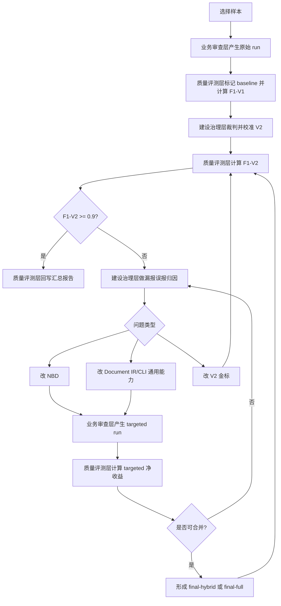

上级导航：[[index|新版 BD 审查点明细库]]

# NBD 可迭代质量工程体系方案

## 1. 定位

本方案用于定义 NBD 从“可运行审查知识”到“可量化质量提升”的完整工程体系。

当前体系不是单纯维护一批审查点，也不是单纯跑一个 CLI。它由三层组成：

```text
业务审查层：151 个 NBD + CLI + 小模型，面向日常待审文件输出业务审查报告。
质量评测层：标准答案 V1/V2 + 召回率/精确率/F1，面向审查效果量化。
建设治理层：Codex 裁判 + NBD/CLI/Document IR 调优，面向体系持续进化。
```

核心目标：

```text
日常审查稳定运行。
质量问题可被量化发现。
调优动作可被复盘验证。
NBD 和 CLI 始终保持干净边界。
```

## 2. 三层体系

### 2.1 业务审查层

业务审查层是日常使用的主链。

输入：

```text
待审采购文件
151 个 maintained NBD
模型配置：qwen3.5-27b 等小模型
```

输出：

```text
业务审查报告
结构化 NBD 结果
可复盘运行目录
```

标准流程：


日常业务命令：

```bash
python3 scripts/nbd_review/main.py run \
  --review-file xxx.docx \
  --base-url http://112.111.54.86:10011/v1 \
  --api-key bssc \
  --model qwen3.5-27b \
  --jobs 10
```

默认产物模式：

```text
run 默认使用 --artifact-mode compact。
compact 保留业务报告、Document IR、CandidateWindow、模型结果、召回矩阵和 artifacts 清单。
compact 清理可重新生成的 prompt 明细和重复 NBD IR。
需要深度排查 prompt 或 NBD IR 时，使用 --artifact-mode full。
```

业务审查层的原则：

- 只调用小模型执行 SOP。
- 不引入 Codex 强模型复核。
- 不依赖标准答案。
- 不以 F1 为业务输出。
- 不把 CLI 改成规则库。
- 只生产原始运行结果，不判断该 run 是 baseline、targeted、final-full 还是 final-hybrid。
- 不负责回写 F1 汇总报告。

### 2.2 质量评测层

质量评测层用于衡量 NBD CLI 的审查效果，不直接参与日常业务审查。

输入：

```text
业务审查层运行目录
原始标准答案 V1
裁判校准后的标准答案 V2
```

输出：

```text
F1-V1 指标
F1-V2 指标
漏报清单
误报清单
工程标准答案格式 JSON
样本汇总报告
```

质量评测层负责给业务审查层产生的 run 赋予评测语义：

```text
baseline：某个样本的全量基线 run。
targeted：围绕一个或少量 NBD 的定向验证 run。
final-full：一个可直接回写总表的全量最终 run。
final-hybrid：由全量 run 与已验证净收益 targeted run 组成的最终评测口径。
```

这些语义只存在于质量评测层和建设治理层，不进入业务审查层。业务审查层只知道自己完成了一次 NBD 审查。

指标口径：

```text
召回率 = 匹配成功数 / 标准答案数
精确率 = 匹配成功数 / 工程输出数
F1 值 = 2 * 召回率 * 精确率 / (召回率 + 精确率)
```

V1 与 V2 的关系：

```text
V1：人工原始标准答案。
V2：以 151 个 NBD 原子审查点为口径校准后的标准答案。
```

V2 的形成规则：

1. 若 V1 中一个审查点实际包含多个 151 NBD 审查点，应拆成多个原子审查点。
2. 若工程额外输出的审查点经 Codex 裁判确认为真实风险，且属于 151 NBD 覆盖范围，应补入 V2。
3. 若工程额外输出的风险真实存在，但不属于当前 151 NBD 覆盖范围，应标记为“新增”，评测时忽略。
4. 若工程额外输出不构成风险，应作为误报处理，进入 NBD 或 CLI 边界收紧。
5. 若 V2 中某个复合审查点包含“强口径 + 弱口径”，且弱口径经 Codex 裁判不能稳定成立，应做裁判降级：删除弱口径，只保留能被证据支撑的原子审查点。
6. V2 不是放宽标准，也不是为了追高 F1 任意扩金标；V2 的作用是把标准答案校准到 151 个 NBD 的原子执行口径。

常用命令：

```bash
python3 scripts/nbd_review/main.py evaluate-f1 \
  --gold-json 标准答案.json \
  --run-dir validation/nbd-runs/某次运行 \
  --output-dir validation/nbd-runs/某次运行/evaluation-v1 \
  --line-match range
```

```bash
python3 scripts/nbd_review/main.py export-gold-like \
  --output-dir validation/nbd-runs/某次运行
```

```bash
python3 scripts/nbd_review/main.py update-f1-summary \
  --summary-md validation/nbd-runs/某批次汇总报告.md \
  --case-no 4 \
  --run-dir validation/nbd-runs/某次运行 \
  --status 专项完成
```

质量评测层的触发条件：

- 新样本首次验证。
- 某批样本全量复跑。
- F1-V2 低于目标值。
- 业务审查结果出现明显漏报或误报。
- NBD 或 CLI 调整后需要回归验证。

单案例专项提升时，质量评测层还负责维护每轮 P 阶段指标：

```text
P0 baseline：计算当前 151 全量基线的 F1-V1 / F1-V2。
P1/P2/P3... targeted：计算定向验证 run 的净收益。
P-hybrid：合并已验证净收益输出并重新计算 F1-V1 / F1-V2。
P-gold-calibration：对 V2 金标做原子化、补标、忽略新增、裁判降级。
P-final：确认最终口径并回写总表。
```

P 阶段不是固定数量。若 P0 已达标，可直接进入 P-final；若未达标，则继续 targeted 与 hybrid 验证，直到 F1-V2 达标或进入暂不处理结论。

### 2.3 建设治理层

建设治理层用于判断问题原因，并决定改哪里。

Codex 在建设治理层的角色：

```text
强模型裁判
方法论工程师
质量归因者
NBD 与 CLI 边界守门人
```

建设治理层不进入日常业务审查链路。

主要工作：

1. 判断漏报是候选没召回、候选已召回但小模型未输出、还是标准答案口径不一致。
2. 判断误报是 NBD 边界过宽、CLI 召回过宽、Document IR 结构错误，还是 V2 金标漏标。
3. 决定整改对象：NBD、Document IR、Recall Runner、Prompt Builder、Postprocessor、V2 标准答案。
4. 防止 CLI 变成第二套规则库。
5. 将有效调优沉淀为 NBD SOP、召回协议、反证词、输出协议或评测脚本。
6. 裁判 targeted run 是否有净收益，决定是否允许进入 final-hybrid。
7. 裁判 final-hybrid 是否成立，证明其可复盘、可回退、未污染 runtime。

建设治理层的问题分流：

| 现象 | 优先判断 | 整改方向 |
|---|---|---|
| 标准答案有，工程没有候选 | 候选召回不足 | 补 NBD 召回剖面或优化 Document IR |
| 候选已召回，小模型未输出 | SOP 不够可执行 | 强化 NBD 判断步骤和输出协议 |
| 工程输出很多同类重复 | 输出边界不清 | 收紧 NBD candidate 输出规则 |
| 工程输出看似误报但确是真风险 | V2 金标漏标 | Codex 裁判后补入 V2 |
| 工程输出真实但不属于 151 | 覆盖范围外风险 | 标为新增，评测忽略 |
| 标准答案复合口径中部分风险不成立 | V2 弱口径 | 裁判降级，只保留成立的原子审查点 |
| 工程输出确属误报 | 判断条件过宽 | 收紧 NBD 命中/排除/反证词 |
| F1 调优后下降 | 扩召回或扩输出过度 | 用 compare-f1-runs 自动归因 |
| CLI 出现 NBD ID 专属逻辑 | 运行时污染 | 移回 NBD markdown 或删除 |

## 3. 标准闭环

完整质量提升闭环：



达标条件：

```text
单样本专项目标：F1-V2 >= 0.9
同时关注：精确率不能靠大量补 V2 虚高，召回率不能长期偏低。
```

低于 0.9 时，不直接大范围改动，应先做专项分析：

```text
漏报按 NBD/问题类型聚合。
误报按 NBD/问题类型聚合。
优先处理能同时提升召回率和精确率的问题。
只合并净收益明确的 NBD 输出。
```

### 3.1 单案例专项提升协议

单案例专项提升用于复制“家具案例四”这类逐轮提升模式。

阶段定义：

| 阶段 | 所属层 | 目标 | 产物 |
|---|---|---|---|
| P0 baseline | 质量评测层 | 给全量 run 建立 V1/V2 基线 | `evaluation-v1/`、`evaluation-v2/`、首轮指标 |
| P1 归因账本 | 建设治理层 | 聚合漏报、误报、V2 口径问题 | 专项账本 |
| P2+ targeted | 质量评测层 + 建设治理层 | 对高收益 NBD 或问题族做定向验证；底层仍调用业务审查层产生原始 run | targeted run、净收益结论 |
| P-gold-calibration | 质量评测层 + 建设治理层 | 处理 V2 原子化、补标、忽略新增、裁判降级 | V2 变更记录、评测前后指标 |
| P-hybrid | 质量评测层 | 合并已验证净收益输出，重新计算 V1/V2 | hybrid run 或 hybrid 评测口径 |
| P-final | 质量评测层 + 建设治理层 | 确认最终口径并回写总表 | 最终指标、总表更新、最终 run 链接 |

执行规则：

```text
业务审查层只负责产生 run，不关心 run 的 P 阶段语义。
质量评测层负责将 run 标记为 baseline、targeted、final-full 或 final-hybrid。
建设治理层负责解释为什么某个 targeted 输出可以或不可以合并。
P 阶段数量自适应，不预设必须跑到 P9。
P-gold-calibration 可以出现在任一阶段，但必须说明是补标、忽略新增、原子化还是裁判降级。
只有 F1-V2 达标且精确率没有不可接受下降时，才进入 P-final。
```

### 3.2 final-hybrid 合并协议

final-hybrid 是评测与治理口径，不是业务审查层能力。

允许合并的条件：

```text
targeted run 只涉及明确的问题族或少量 NBD。
该 targeted 输出能增加 V2 匹配成功数。
该 targeted 输出不引入明显 V2 误报，或误报经 Codex 裁判确认为 V2 漏标。
该 targeted 输出的来源 run、NBD、行号和证据可追溯。
合并后重新计算 F1-V1 / F1-V2。
```

不允许合并的情形：

```text
targeted 输出只是让工程输出数膨胀，但匹配成功数没有增加。
targeted 输出依赖 CLI 中的 NBD 专属硬编码。
targeted 输出无法追溯到候选窗口和模型结果。
targeted 输出只能靠任意扩充 V2 才能提高 F1。
```

final-hybrid 必须写清：

```text
基础 full run 是哪个。
合并了哪些 targeted run。
每个 targeted run 涉及哪些 NBD。
合并前后 V1/V2 指标变化。
哪些 V2 项经过 Codex 裁判校准。
为什么没有污染业务审查层。
```

### 3.3 业务审查层与 P 阶段的关系

P 阶段会调用业务审查层，但业务审查层不理解 P 阶段。

```text
P0 需要一次 151 全量 run：由业务审查层执行，质量评测层标记为 baseline。
P2+ 需要定向 run：由业务审查层按参数执行，质量评测层标记为 targeted。
P-final 需要 final-full 或 final-hybrid：由质量评测层组织评测口径，建设治理层证明其合理。
```

因此，“targeted run”不是业务审查层的新状态，只是质量评测层对某次业务 run 的用途标记。

### 3.4 家具案例五复盘结论

家具案例五是当前体系里的关键样本，因为它同时暴露了业务审查层、质量评测层和建设治理层之间的边界问题。

过程摘要：

```text
P0 baseline：建立 151 全量基线，发现 V1 行号存在整体偏移，V2 行号更适合作为质量门。
P1/P2：修复质量门误伤，避免评测层把正确命中误判为结构错误。
P3-P7：围绕样品、检测报告、技术参数、验收、履约保证金等问题族做 targeted 和 hybrid。
P10：Codex 裁判确认 line795 检测报告主体和 line1109 合理检测时间属于弱口径，进行 V2 裁判降级。
最终结果：V2 标准答案数从 48 降至 46，匹配数保持 39，召回率 0.8478，精确率 0.9750，F1-V2 达到 0.9070。
```

案例五说明：

1. F1 低不一定都是 NBD 或 CLI 差，也可能是 V1/V2 金标口径过粗、行号偏移或复合审查点拆分不足。
2. 质量评测层必须有“金标健康检查”和“裁判降级”能力，否则会把不稳定弱口径长期当成工程漏报。
3. targeted run 不能直接替代业务 run，必须经过净收益判断；否则扩召回容易带来输出膨胀。
4. final-hybrid 是评测口径，不是业务审查层的新运行模式；业务审查层仍只负责按 NBD 和待审文件产生原始审查结果。
5. CLI 不能因个案 F1 压力写入 NBD 专属规则；案例五的有效提升来自 NBD SOP、V2 裁判和质量评测口径，而不是把业务规则塞进 runtime。

案例五形成的工程设计要求：

| 问题 | 工程设计调整 |
|---|---|
| V1 行号偏移导致 F1-V1 极低 | `evaluate-f1` 必须保留金标行号健康检查，并明确 V1 可作为历史参考、V2 才是当前质量门 |
| 复合审查点导致虚假漏报 | 质量评测层需要显式支持 V2 原子化和裁判降级记录 |
| targeted run 多、阶段多，人工容易漏回写 | 需要单案例专项流水线，把 baseline、targeted、hybrid、gold-calibration、summary update 串起来 |
| final-hybrid 来源复杂 | `build-hybrid` 需要生成合并来源清单，记录基础 run、targeted run、NBD、行号、净收益 |
| V2 变更散落在 JSON 和报告 | 建设治理层需要统一的 V2 变更账本，记录补标、忽略新增、降级和不处理理由 |
| 指标下降时靠人工回看 | `compare-f1-runs` 和 `diagnose-f1` 应成为专项流水线的自动步骤 |

## 4. 工程目录映射

当前代码和产物已经可按三层理解，但目录和文件名仍偏历史演进形态。后续应把工程命名调整为“入口统一、三层分明、运行时干净”。

调整原则：

```text
main.py 仍是唯一总入口。
业务审查层、质量评测层、建设治理层分别放入明确目录。
公共数据结构和工具放入 shared，不归属于任一业务层。
历史脚本可先保留兼容壳，内部逐步迁移，避免一次性大改造成运行风险。
```

目标目录：

```text
scripts/nbd_review/
  main.py                         # 唯一 CLI 入口

  business_review/                # 业务审查层：日常主链
    pipeline.py
    document_compiler.py
    nbd_compiler.py
    recall_runner.py
    prompt_runner.py
    model_runner.py
    postprocessor.py
    reporters.py

  quality_eval/                   # 质量评测层：F1、V1/V2、汇总
    evaluate_f1.py
    export_gold_like.py
    update_f1_summary.py
    run_roles.py
    hybrid_builder.py

  governance/                     # 建设治理层：诊断、对比、运行时 lint
    compare_f1_runs.py
    diagnose_f1.py
    ledger.py
    lint_runtime.py
    run_index.py

  shared/                         # 跨层公共能力
    schemas.py
    utils.py
```

各层命名含义：

| 目录 | 层级 | 允许做什么 | 不允许做什么 |
|---|---|---|---|
| `business_review/` | 业务审查层 | 编译文档、编译 NBD、召回候选、构造 prompt、调用小模型、生成业务报告 | 读取标准答案、计算 F1、调用 Codex 裁判 |
| `quality_eval/` | 质量评测层 | 导出工程 JSON、计算 V1/V2 指标、更新汇总报告、跑单案例评测流水线 | 影响业务审查结论、写入 NBD 专属规则 |
| `governance/` | 建设治理层 | F1 下降归因、漏报误报诊断、运行时硬编码检查、run 索引 | 直接替代业务审查、把裁判逻辑塞进日常链路 |
| `shared/` | 公共层 | 通用 schema、文件 IO、markdown/json 工具、行号工具 | 放审查业务规则 |

命令也按三层命名：

```text
业务审查层：
  run
  preflight
  compile-document
  compile-nbd
  recall
  build-prompt
  run-model
  report

质量评测层：
  evaluate-f1
  export-gold-like
  update-f1-summary
  mark-run-role
  build-hybrid

建设治理层：
  lint-runtime
  compare-f1-runs
  diagnose-f1
  create-ledger
  index-runs
```

其中：

```text
run 是日常业务唯一推荐入口。
mark-run-role / build-hybrid 是质量评测层口径工具，不进入日常业务链路。
diagnose-f1 / compare-f1-runs 是治理工具，只在 F1 下降或专项复盘时使用。
```

### 4.1 业务审查层代码

```text
scripts/nbd_review/main.py
scripts/nbd_review/business_review/pipeline.py
scripts/nbd_review/business_review/document_compiler.py
scripts/nbd_review/business_review/nbd_compiler.py
scripts/nbd_review/business_review/recall_runner.py
scripts/nbd_review/business_review/prompt_runner.py
scripts/nbd_review/business_review/model_runner.py
scripts/nbd_review/business_review/postprocessor.py
scripts/nbd_review/business_review/reporters.py
scripts/nbd_review/shared/schemas.py
scripts/nbd_review/shared/utils.py
```

对应命令：

```text
run
preflight
compile-document
compile-nbd
recall
build-prompt
run-model
report
```

### 4.2 质量评测层代码

```text
scripts/nbd_review/quality_eval/evaluate_f1.py
scripts/nbd_review/quality_eval/export_gold_like.py
scripts/nbd_review/quality_eval/update_f1_summary.py
scripts/nbd_review/quality_eval/run_roles.py
scripts/nbd_review/quality_eval/hybrid_builder.py
```

对应命令：

```text
evaluate-f1
export-gold-like
update-f1-summary
mark-run-role
build-hybrid
```

其中 `evaluate_f1.py` 当前仍是独立脚本，后续应接入 `main.py evaluate-f1`，使评测层命令统一。

### 4.3 建设治理层代码

```text
scripts/nbd_review/governance/compare_f1_runs.py
scripts/nbd_review/governance/diagnose_f1.py
scripts/nbd_review/governance/ledger.py
scripts/nbd_review/governance/lint_runtime.py
scripts/nbd_review/governance/run_index.py
```

对应命令：

```text
compare-f1-runs
diagnose-f1
create-ledger
lint-runtime
index-runs
```

### 4.4 建设治理层产物

```text
wiki/bd-review-points/NBD-方法论.md
wiki/bd-review-points/NBD标杆生成手册.md
wiki/bd-review-points/NBD类型标杆手册.md
wiki/bd-review-points/NBD可运行知识与CLI运行时协议设计.md
wiki/bd-review-points/NBD日常审查CLI与候选窗口召回方案.md
wiki/bd-review-points/audits/
validation/nbd-runs/*专项分析*
validation/nbd-runs/*汇总报告*
```

### 4.5 运行产物目录

运行产物也应体现三层，但不强制迁移旧目录。

建议新产物从下一阶段开始按以下结构生成：

```text
validation/nbd-runs/
  business-review/
    20260505-品目-案例-run-id/

  quality-eval/
    品目/
      案例N/
        evaluation-v1/
        evaluation-v2/
        工程审查结果_按标准答案格式.json

  governance/
    ledgers/
    comparisons/
    run-index.md
    run-index.json
```

说明：

```text
业务审查层 run 目录仍完整保留 Document IR、NBD IR、候选窗口、prompt、模型结果和业务报告。
质量评测层可以引用业务 run 目录，不复制大文件，只保存评测输入、评测输出和指标。
建设治理层保存账本、对比报告、归因报告和索引。
```

业务 run 的 compact 产物：

```text
保留：
  run.json
  document-ir.json
  candidates/
  model-results/
  recall_matrix.json
  recall_matrix.md
  nbd-results.json
  业务审查报告.md
  artifacts.json
  artifacts.md

清理：
  prompts/
  nbd-ir/
  nbd-ir-lint.json
  nbd-ir-lint.md
```

这样日常业务目录只保留可复盘、可评测、可交付的产物；prompt 和 NBD IR 属于可重新生成的调试中间件，不默认堆在每个业务 run 中。

## 5. 代码是否需要整理优化

结论：需要，但应按“三层边界”整理，不应重写成多套 CLI。

当前代码已经具备三层结构：

- `main.py run` 和 stage 命令支撑业务审查层。
- `evaluate_f1.py / export_gold_like.py / update_f1_summary.py / run_roles.py / hybrid_builder.py` 支撑质量评测层。
- `lint-runtime / compare-f1-runs / diagnose_f1.py / ledger.py / run_index.py` 支撑建设治理层。

当前主要问题不是功能缺失，而是边界表达不够清楚：

```text
根目录仍保留兼容壳，后续可在稳定后逐步减少直接使用旧路径。
validation 产物仍在持续治理中，需要继续完善索引和账本回填。
单案例专项流程已有 run-role、ledger、hybrid 基础能力，后续可继续增强自动净收益判断。
```

建议整理方向：

### 5.1 P0：命令分层说明

目标：不改核心逻辑，先让使用者知道哪些命令属于哪一层。

任务：

- 更新 `main.py --help` 描述或 README，按三层列出命令。
- 保持 `run` 作为唯一日常业务入口。
- 明确 `evaluate_f1 / update-f1-summary / compare-f1-runs` 不是日常业务链路。
- 在本方案中固化目标目录：`business_review / quality_eval / governance / shared`。

验收：

- 新人能从文档判断日常审查只需要 `run`。
- 调优人员能知道 F1 和治理命令何时使用。
- 工程人员能从目录名判断脚本属于哪一层。

### 5.2 P1：建立三层包目录与兼容壳

目标：先完成工程命名分层，不改变外部调用习惯。

任务：

- 新建 `business_review/`、`quality_eval/`、`governance/`、`shared/`。
- 将业务审查层代码迁入 `business_review/`。
- 将 F1 评测代码迁入 `quality_eval/`。
- 将诊断、对比、lint 代码迁入 `governance/`。
- 将 `schemas.py`、`utils.py` 等公共能力迁入 `shared/`。
- 旧位置保留薄兼容壳，避免已有命令和临时脚本马上失效。

验收：

- `python3 scripts/nbd_review/main.py run ...` 仍可运行。
- 旧脚本路径短期内仍可导入或执行。
- 兼容壳只做 import 转发，不新增业务逻辑。
- `lint-runtime` 不发现 NBD 专属硬编码。

### 5.3 P2：把 evaluate_f1 接入 main.py

目标：质量评测层入口统一。

建议命令：

```bash
python3 scripts/nbd_review/main.py evaluate-f1 \
  --gold-json xxx.json \
  --run-dir validation/nbd-runs/xxx \
  --output-dir validation/nbd-runs/xxx/evaluation-v2 \
  --line-match range
```

验收：

- 保留 `evaluate_f1.py` 独立运行能力。
- `main.py evaluate-f1` 与独立脚本输出一致。

### 5.4 P3：建立样本专项流水线脚本

目标：减少手工漏步骤。

建议能力：

```text
输入：case_no、review_file、gold_v1、gold_v2、summary_md、run_dir。
动作：跑审查、导出工程 JSON、计算 V1/V2、更新汇总报告。
输出：专项运行目录和指标摘要。
```

验收：

- 一个案例完成后自动更新汇总报告。
- 明确记录 V1/V2 的标准答案数、工程输出数、匹配数、召回率、精确率、F1 值。

### 5.5 P4：治理层账本标准化

目标：每个专项调优都有统一结构。

账本字段：

```text
样本
基线 run
目标 run
F1-V1 / F1-V2 前后对比
漏报分类
误报分类
裁判结论
整改对象：NBD / CLI / Document IR / V2 / 暂不处理
合并策略
最终指标
是否回写汇总报告
```

验收：

- 任一案例能复盘为什么改、改了哪里、指标为什么变。
- F1 下降时能快速定位原因。

### 5.6 P5：运行产物索引

目标：减少 `validation/nbd-runs/` 目录查找成本。

建议生成：

```text
validation/nbd-runs/governance/run-index.json
validation/nbd-runs/governance/run-index.md
```

索引字段：

```text
run_id
样本
品目
运行层级
模型
NBD 数量
失败数
V1 指标
V2 指标
是否专项最终 run
是否已回写汇总报告
```

验收：

- 可以快速找到最近一次最终 run。
- 可以按品目、案例、F1 阶段筛选。

### 5.7 P6：V2 变更账本与金标校准工具

目标：把案例五中手工完成的 V2 裁判降级工程化，避免 V2 JSON、专项账本和汇总报告三处人工同步。

建议能力：

```text
输入：gold_v2、case_no、变更类型、行号、原审查点、调整后审查点、裁判理由。
动作：校验变更是否仍属于 151 NBD 原子审查点；回写 V2 元数据；复算 evaluation-v2；生成变更摘要。
输出：V2 变更账本、复算前后指标、剩余漏报误报清单。
```

变更类型：

```text
atomic-split：复合审查点拆成多个原子审查点。
add-gold：工程输出经 Codex 裁判确认为 V2 漏标。
ignore-new：真实风险但不属于 151，标记为新增并从 F1 忽略。
downgrade-gold：复合审查点中部分弱口径不成立，只保留成立原子项。
reject-output：工程输出不成立，作为误报进入 NBD/CLI 边界收紧。
```

验收：

- V2 变更必须有结构化理由，不能只改 JSON 文本。
- 每次 V2 变更后自动复算 F1-V2。
- 指标变化必须写入专项账本和批次汇总报告。
- 业务审查层不读取 V2 变更账本。

### 5.8 P7：单案例专项流水线增强

目标：把案例五的 P0 到 P10 经验固化为可重复流程。

建议命令：

```bash
python3 scripts/nbd_review/main.py case-quality \
  --case-no 5 \
  --review-file xxx.docx \
  --gold-v1 xxx.json \
  --gold-v2 xxx_V2.0.json \
  --summary-md validation/nbd-runs/家具15个样本全量复跑汇总报告（NBD CLI）-20260504.md \
  --run-dir validation/nbd-runs/某次运行 \
  --target-f1 0.9
```

该命令不替代 Codex 裁判，只负责把固定步骤串起来：

```text
1. 导出工程标准答案格式 JSON。
2. 计算 F1-V1 和 F1-V2。
3. 执行金标行号健康检查。
4. 聚合漏报和误报。
5. 对比上一轮指标，若 F1 下降，自动生成下降归因。
6. 回写专项账本和汇总报告。
```

验收：

- 案例五这类多轮过程不再依赖人工记住每个复算和回写步骤。
- 达到 F1-V2 目标后，自动把状态从“专项进行中”更新为“专项完成”。
- 若未达标，自动列出下一轮优先处理的 NBD 和问题类型。

## 6. 严格边界

### 6.1 不允许

- 不允许在 CLI 中写 `if NBD07-006` 这类专属业务判断。
- 不允许把 V2 当作业务审查输出。
- 不允许为了提高 F1 任意补金标。
- 不允许为了提高 F1 任意删除或降级金标；降级必须有 Codex 裁判理由和 V2 变更账本。
- 不允许把 Codex 强模型裁判放进日常审查链路。
- 不允许用评测脚本替代业务审查报告。

### 6.2 允许

- 允许 CLI 实现通用运行时能力，例如 NBD 反证词、噪声词、候选去重、行号匹配。
- 允许 NBD 增加召回词、反证词、输出协议和排除条件。
- 允许 Codex 在建设治理层裁判 V2 是否漏标。
- 允许对 Document IR 的结构识别能力做通用优化。
- 允许用专项 hybrid 验证单个 NBD 的净收益，但最终应回到可复跑链路。

## 7. 当前状态

截至本方案形成时：

```text
NBD 数量：151
NBD 状态：maintained
日常审查 CLI：已可运行 151 全量
F1 评测：已支持 V1/V2
汇总报告：已支持单案例指标回写
Codex 裁判：已用于 V2 校准和专项调优
```

近期样本专项已经验证：

```text
信息化设备：通过专项处理证明 V2 可显著校准原始金标口径。
物业管理：通过 V1/V2 对比证明三方裁判口径有必要。
家具：案例一至案例四已按“跑全量、校准 V2、调 NBD、复算 F1、回写总表”闭环推进；案例五进一步验证了 V2 裁判降级、金标健康检查和 final-hybrid 净收益合并的必要性。
```

## 8. 下一步建议

建议先不大改业务审查主链，优先做轻量工程整理：

1. 将本方案作为后续 NBD 调优总纲。
2. 将 `evaluate_f1.py` 接入 `main.py evaluate-f1` 并保留金标行号健康检查。
3. 建立 V2 变更账本和金标校准工具，支持补标、忽略新增、原子化、裁判降级。
4. 建立“单案例专项流水线”命令，减少重复手工操作。
5. 建立 `validation/nbd-runs` 运行索引。
6. 继续按样本逐个提升 F1-V2，达标后自动回写批次汇总报告。

这样可以保持业务审查层稳定，同时让质量评测层和建设治理层越来越工程化。

## 9. 2026-05-05 工程配套执行结果

本轮按第 8 节建议完成 1-6 项配套，不改业务审查主链，只增强质量评测层和建设治理层。

| 任务 | 状态 | 执行结果 |
|---|---|---|
| 1. 固化本方案为后续 NBD 调优总纲 | 已完成 | 本文档补充案例五复盘、P-gold-calibration、V2 裁判降级、V2 变更账本和 case-quality 流水线设计 |
| 2. `evaluate-f1` 接入统一入口并保留金标行号健康检查 | 已完成 | `main.py evaluate-f1` 已可输出 V1/V2 指标、金标行号健康检查、漏报、误报和忽略新增项 |
| 3. 建立 V2 变更账本和金标校准工具 | 已完成 | 新增 `main.py record-gold-change`，支持 `add-gold`、`ignore-new`、`atomic-split`、`downgrade-gold`、`reject-output` |
| 4. 建立单案例专项流水线 | 已完成 | 新增 `main.py case-quality`，串联工程 JSON 导出、F1-V1/F1-V2 复算、run-role 标记、可选总表回写 |
| 5. 建立 `validation/nbd-runs` 运行索引 | 已完成 | 已生成 `validation/nbd-runs/governance/run-index.json` 与 `run-index.md` |
| 6. 继续按样本提升 F1-V2，达标后回写汇总报告 | 已完成阶段性能力 | 用家具案例五 final-hybrid run 验证 `case-quality`，复算结果为 V1-F1 0.0588、V2-F1 0.9070；后续案例可复用同一流水线 |

新增代码：

```text
scripts/nbd_review/quality_eval/gold_changes.py
scripts/nbd_review/quality_eval/case_quality.py
scripts/nbd_review/main.py
```

新增或更新产物：

```text
validation/nbd-runs/20260505-furniture-case05-p7-hybrid-02042-06019-07001/case-quality.json
validation/nbd-runs/20260505-furniture-case05-p7-hybrid-02042-06019-07001/case-quality.md
validation/nbd-runs/governance/run-index.json
validation/nbd-runs/governance/run-index.md
```

验证结果：

```text
PYTHONDONTWRITEBYTECODE=1 python3 -m py_compile ... 通过
python3 scripts/nbd_review/main.py --help 通过
python3 scripts/nbd_review/main.py record-gold-change --help 通过
python3 scripts/nbd_review/main.py case-quality --help 通过
python3 scripts/nbd_review/main.py case-quality ... 案例五复算通过，V2-F1=0.9070
python3 scripts/nbd_review/main.py index-runs ... 通过
```
